## Proyecto Mi Librería EQUIPO 6 - Angular + Laravel

proyecto generado utilizando [Angular CLI](https://github.com/angular/angular-cli) version 20.0.5.

## Integrantes del equipo

Martínez López Fátima Desarrollador y diseñador

Guzmán Jiménez Alary Desarrollador y diseñador

## Descripción

Proyecto de aplicación web para una librería en línea, donde usuarios pueden buscar y comprar libros, mientras que administradores gestionan el inventario, usuarios y pedidos. La aplicación está dividida en:

Frontend Angular: Interfaz de usuario interactiva, búsqueda, carrito y checkout.
Backend Laravel: API RESTful para gestión, autenticación y control de datos.

---

## Estructura general del proyecto

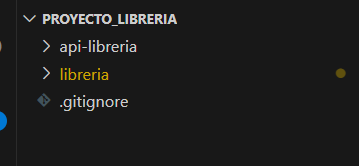

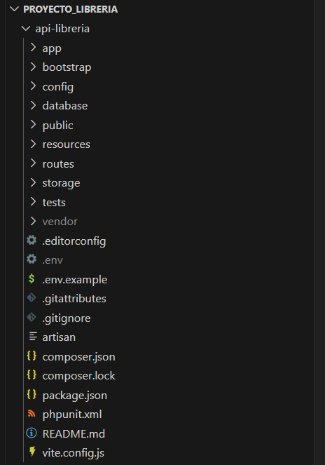

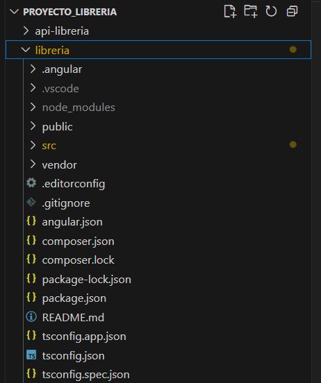

---

## Frontend Angular

 **Características principales**  

Página principal con carrusel, libros destacados y últimos lanzamientos.

Sistema de búsqueda en tiempo real con filtro por categorías y subcategorías.

Visualización detallada de cada libro con imagen, descripción, stock y precio.

Carrito de compras flotante con gestión de cantidades y total actualizado.

Proceso de checkout con formulario para dirección, método de pago y resumen de compra.

Autenticación y registro de usuarios con validaciones.

Panel de administración para usuarios con rol admin (desde frontend y backend).

---

## Funcionalidades para Usuario Normal (Cliente)

- **Navegación sencilla y clara:**  
  El usuario puede navegar por la librería con un menú de categorías desplegables, barra de búsqueda con sugerencias en tiempo real y acceso rápido a su carrito de compras.

- **Búsqueda avanzada:**  
  Búsqueda por título, autor o palabra clave, con resultados instantáneos que muestran portada, autor, precio y calificación.

- **Visualización de libros:**  
  Los libros se presentan en tarjetas con imagen, título, autor, precio, calificación y botón para agregar al carrito.

- **Carrito de compras flotante:**  
  El usuario puede agregar libros al carrito, modificar cantidades, ver el total actualizado y proceder al pago. Además, se muestra un mensaje de envío gratuito si el monto supera un límite.

- **Cuenta de usuario:**  
  Inicio de sesión para acceder a información personalizada, ver su nombre y correo, y cerrar sesión de forma segura.

- **Carruseles de destacados y últimos lanzamientos:**  
  Se exhiben libros recomendados y novedades mediante carruseles con navegación sencilla.

- **Detalle de libro:**  
  Página individual con información completa del libro, descripción, disponibilidad, precio y opción para agregar al carrito.

- **Checkout y pago:**  
  Formulario para capturar datos de envío y método de pago, resumen del pedido con precios detallados y confirmación.

- **Mensajes y estados claros:**  
  Indicadores de carga, mensajes amigables cuando no hay resultados o stock agotado.

---

## Funcionalidades para Administrador

- **Gestión de catálogo:**  
  Creación, edición y eliminación de libros, incluyendo detalles como título, autor, categoría, precio, stock y descripción.

- **Control de inventario:**  
  Visualización y actualización del stock disponible para cada libro.

- **Gestión de usuarios:**  
  Administración de cuentas de clientes y otros administradores, control de acceso y roles.

- **Visualización de pedidos:**  
  Consulta y seguimiento de pedidos realizados por los clientes, incluyendo estado y detalles.

- **Reportes y estadísticas:**  
  Análisis de ventas, libros más vendidos, y otras métricas para la toma de decisiones.

- **Configuración de la tienda:**  
  Ajustes generales como categorías, políticas de envío, métodos de pago y otras preferencias.

---

## Estructura de Angular

- **Componentes principales:**  
  - `home.component`: Página principal con carruseles y listados.  
  - `libro-detalle.component`: Vista detallada de un libro.  
  - `search-results.component`: Resultados de búsqueda y filtros.  
  - `checkout.component`: Proceso de finalización de compra.  
  - `carrito-flotante.component`: Bolsa de compras accesible desde cualquier página.

- **Servicios:**  
  - Gestión de libros, usuarios, carrito y pedidos.  
  - Comunicación con backend para datos persistentes.

- **Rutas:**  
  Navegación entre páginas principales y funcionales.

- **Estilos y diseño:**  
  Uso de CSS moderno con diseño responsivo y experiencia de usuario optimizada.

---

## Tecnologías usadas

- Angular (TypeScript, HTML, CSS)    
- Formularios reactivos para validación  
- Pipes para formatos de moneda y números  
- Directivas estructurales (`*ngIf`, `*ngFor`) para control de vistas  
- Servicios e inyección de dependencias para lógica compartida

---

## Cómo usar esta aplicación

1. Clonar el repositorio  
2. Ejecutar `npm install` para instalar dependencias  
3. Ejecutar `ng serve` para correr la aplicación en modo desarrollo  
4. Abrir `http://localhost:4200` en el navegador  
5. Navegar como usuario normal para explorar y comprar libros  
6. Iniciar sesión con cuenta de administrador para gestionar la tienda

---

##  Capturas de Pantalla

###  Login y Registro

Pantallas simples y funcionales para iniciar sesión o crear una cuenta nueva.

  

  

  

  

---

###  Página de Inicio

Vista principal del usuari normal con el carrusel de libros destacados.

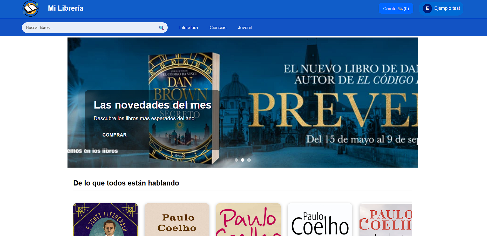

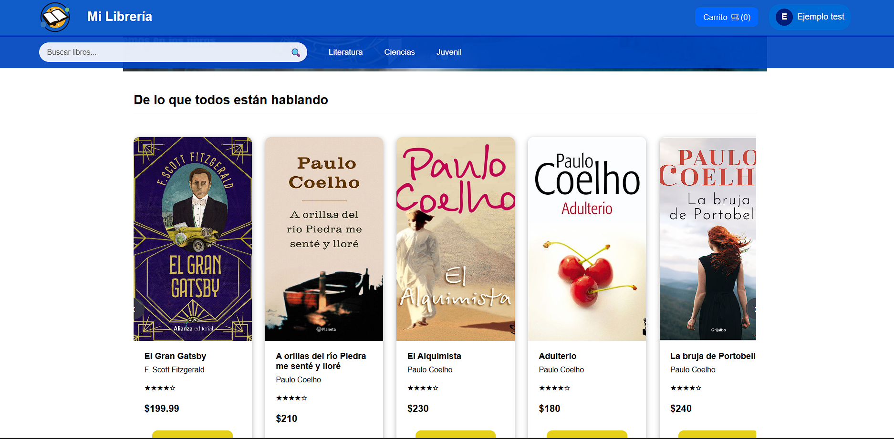

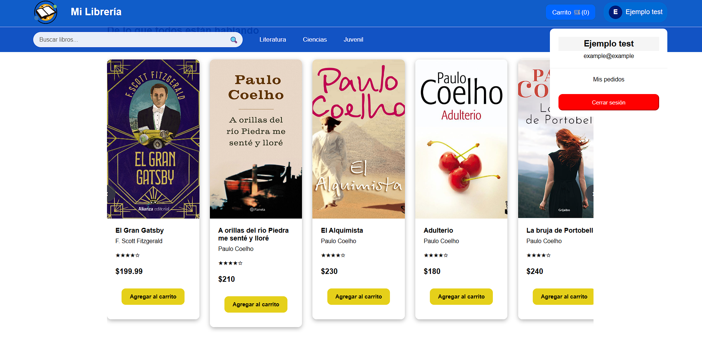

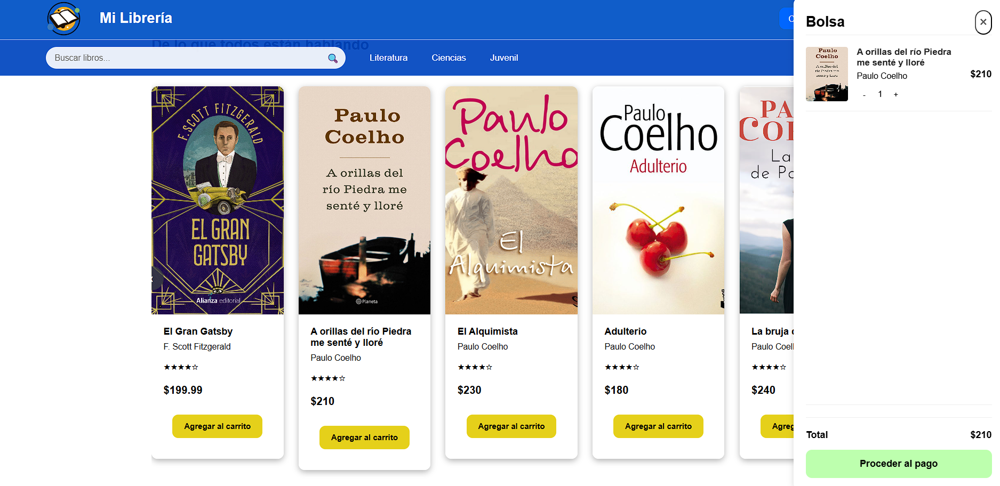

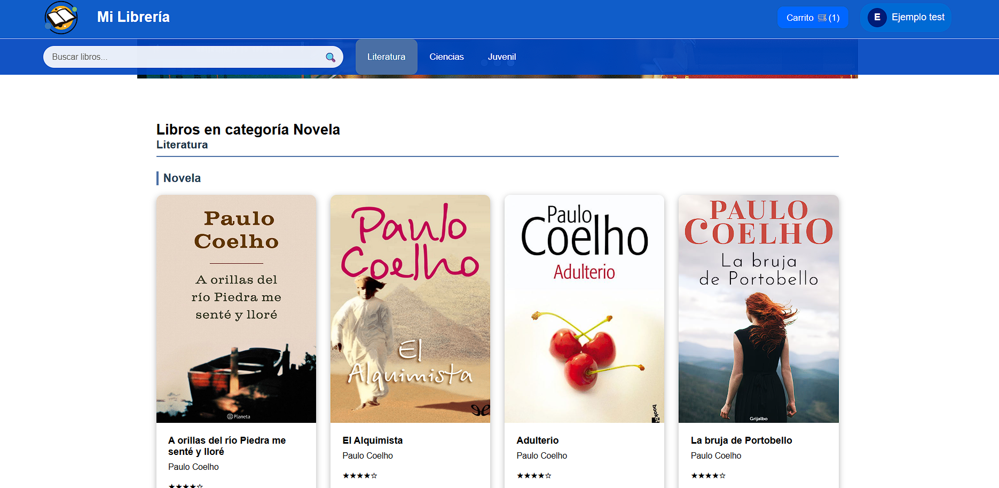

---

###  Búsqueda de Libros y Filtros

Búsqueda por título, autor o palabra clave con resultados inmediatos.

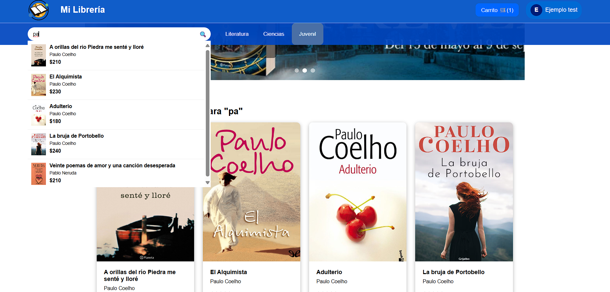

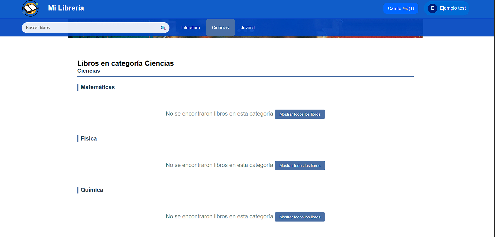

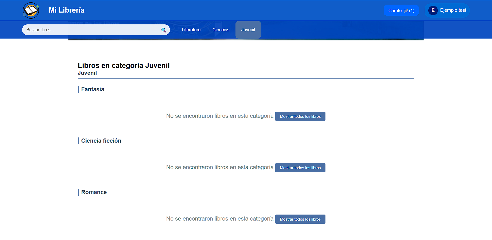

---

###  Detalle del Libro

Información completa del libro, stock, descripción y botón para agregar al carrito.

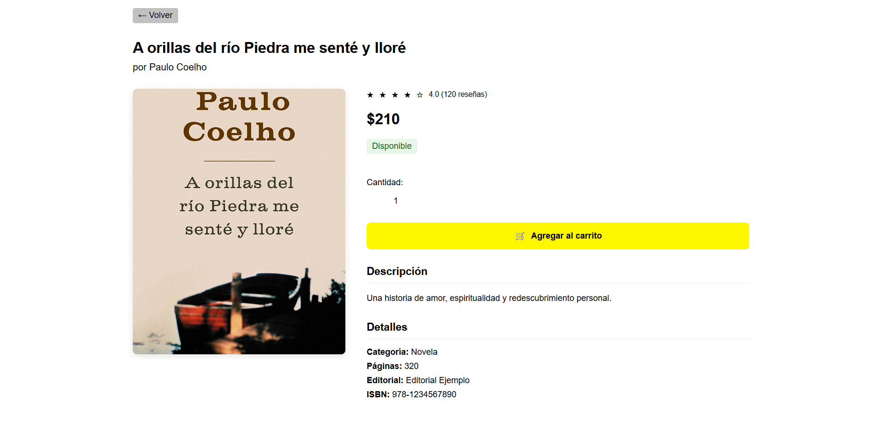

---

### Realización de la Compra y Checkout

Bolsa de compras flotante con control de cantidades, subtotal y botón de pagar.

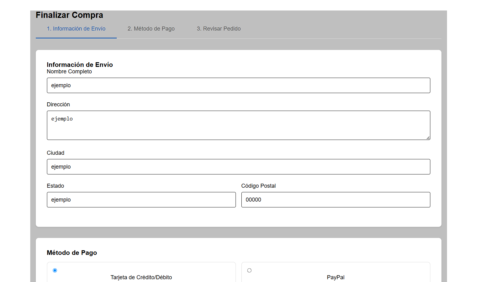

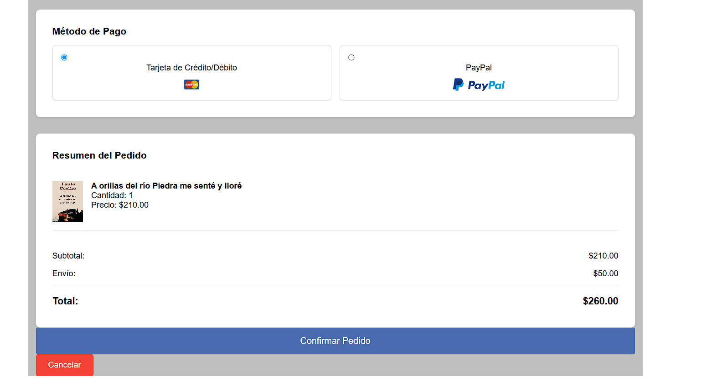

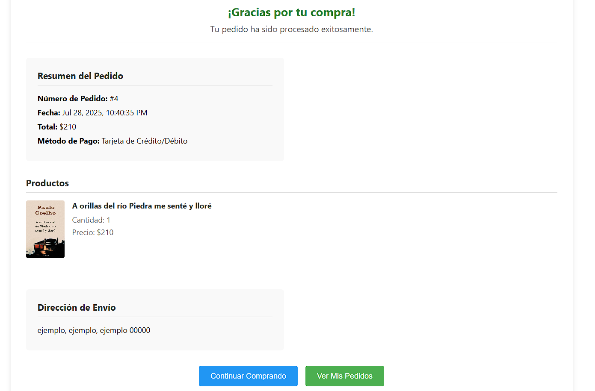

---

###  Vista del Administrador 

Espacio para que los administradores gestionen libros, pedidos y usuarios.

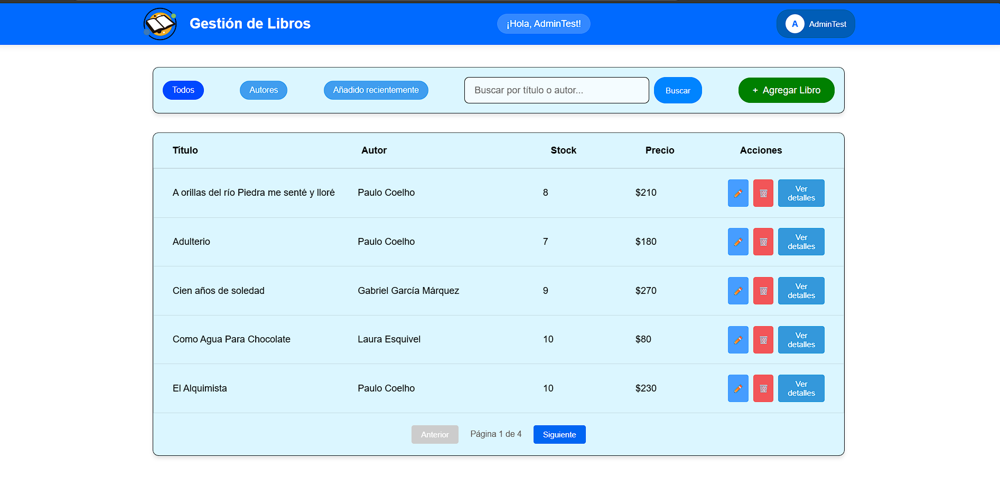

---

###  Visualizacion del libro y generacion de repostes.

Visualizacion desde el usuario administrador del libro y reporte.

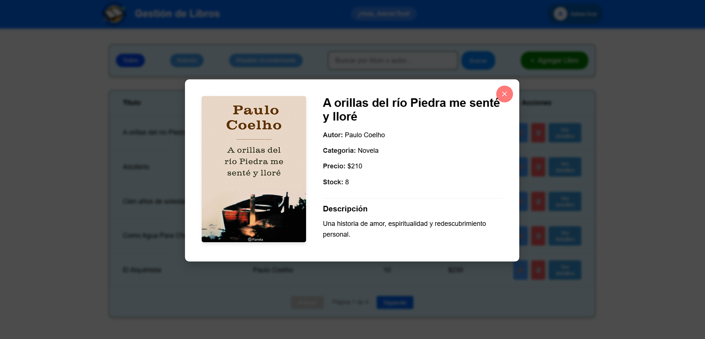

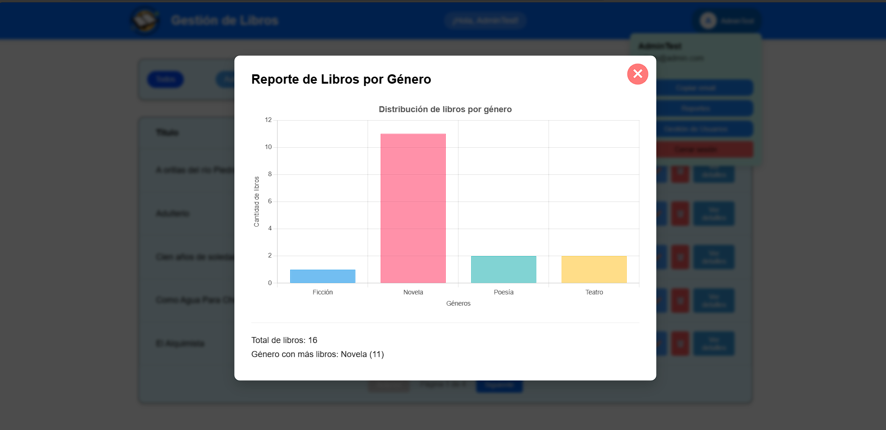

---

###  Gestion de usuarios (creacion y edicion)

gestion de usuario, edicion, creacion y eliminaci´0n.

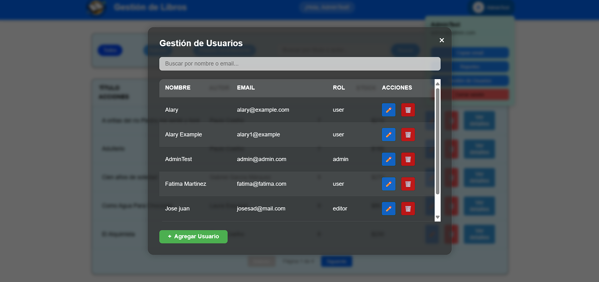

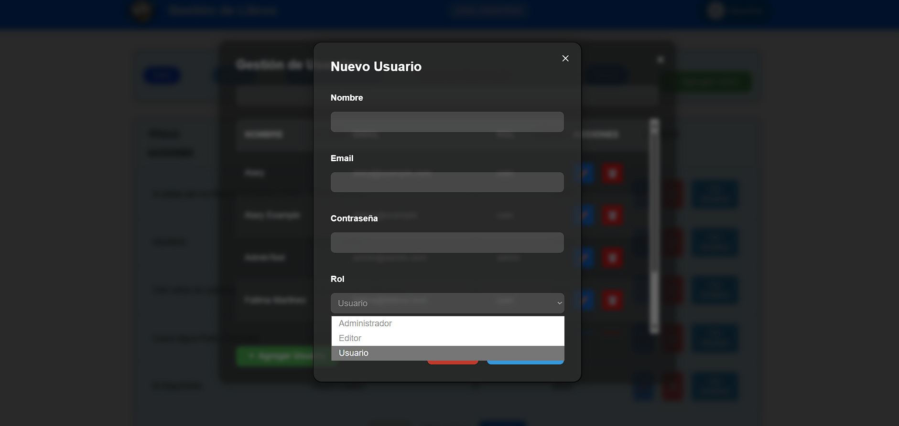

---

## Backend Laravel

 **Características principales**  

API REST para gestión completa de librería.

Control de roles (admin, editor, user).

Registro y autenticación con Laravel Sanctum (tokens API).

CRUD para libros, usuarios, carritos y pedidos.

Control de stock automático.

Soporte para búsquedas y filtros.

---

## Roles y seguridad

 **admin**  

Control total de libros, usuarios y pedidos

 **user** 

 Compra, visualización y carrito

---

## Estructura base de datos

 **tabla books**  

id, title, author, description, category, price, stock, cover_url

 **tabla user** 

id, name, email, password, role

 **tabla cart_items** 

 id, user_id, book_id, quantity, unit_price

  **tabla orders** 

  id, user_id, total, status, shipping_address, payment_method

   **tabla order_items** 

   id, order_id, book_id, quantity, unit_price
